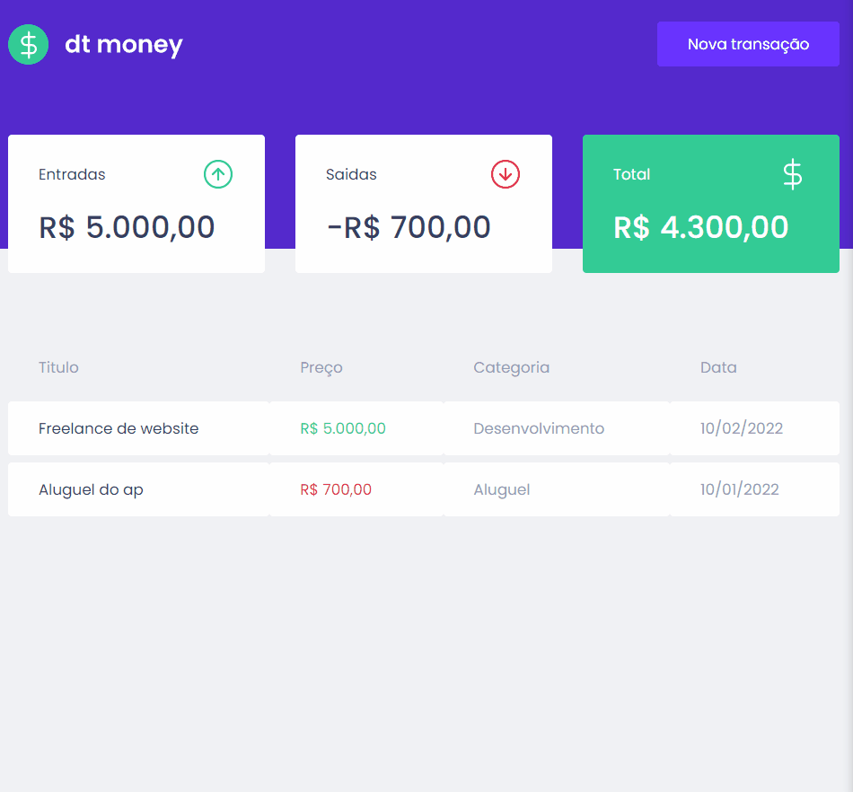

# dtMoney

dtMoney é uma aplicação para controle de finanças pessoais criando com React-js na trilha do módulo 2 de React na plataforma Rocketseat. Os dados das transações são salvos em uma api criada com Mirage no próprio projeto.

<h1 align="center">
  
</h1>

<p align="center">
  <a href="#features">Features</a> •
  <a href="#requisitos">Pré Requisitos</a> •
  <a href="#tecnologias">Tecnologias</a> •
  <a href="#autor">Autor</a> •
</p>

<h4 align="center">🚧 Projeto dtMoney 🚀 Em constução....🚧 </h4>

## Features
- [x] Adicionar uma nova transação
- [x] Listagem de todas as transações
- [x] Controle de entradas, saídas e total


In the project directory, you can run:

## Requisitos
Antes de começar você vai precisar ter instalado em sua máquina as seguites ferramentas: <a href="https://git-scm.com/">git</a> e <a href="https://nodejs.org/en/">NodeJS</a>.

Além disso é bom ter um editor para trabalhar com o código como <a href="https://code.visualstudio.com/">VsCode</a>.
```bash
# Clone este repositório
$ git clone https://github.com/mguib/02-dtmoney2-reactjs.git

# Acesse a pasta do projeto no terminal/cmd
$ cd 02-dtmoney2-reactjs

# Instale as dependências
$ yarn
# OU
$ npm i

# Execute a aplicação em modo de desenvolvimento
$ npm start
#OU
$ yarn start
```


## Tecnologias
Este projeto foi criando com React utilizando TypeScript
As seguintes ferramentas foram usadas na constução do projeto:
- [TypeScript]
- [React]
- [Styled Components]
- [TypeScript]
- [Node.js]
- [MirageJS]
- [Context API]

## Autor

Made with 💜 by Marcos Guibson✌ [See my LinkedIn](https://www.linkedin.com/in/marcos-guibson-santos-da-silva-0b62321a3/)
